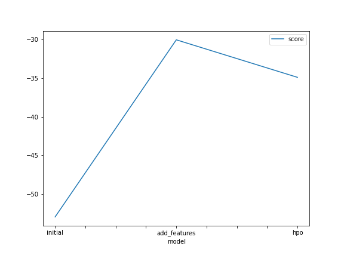
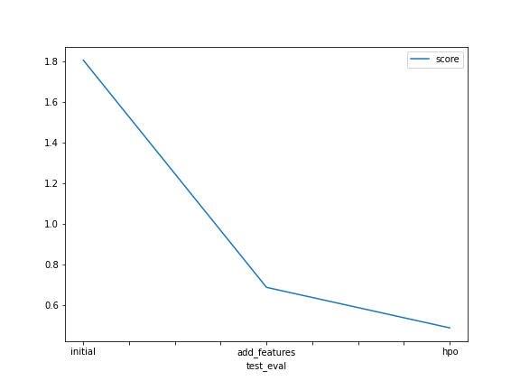

# Report: Predict Bike Sharing Demand with AutoGluon Solution
#### Lucia del Valle Ledezma

## Initial Training
### What did you realize when you tried to submit your predictions? What changes were needed to the output of the predictor to submit your results?

I realized that if the prediction are negative an error occurs, In order to solve that, I had to set all values to 0.

### What was the top ranked model that performed?
 The top ranked model was WeightedEnsemble_L3

## Exploratory data analysis and feature creation
### What did the exploratory analysis find and how did you add additional features?
First of all I realized that dataset has a datatime feature, as I learned in the clasroom this field ca be splitted.
In the first moment I tried only adding the hour feature, but for standard suggesstions I splitted the date in individual parts, hour, day, month and year.
Ref. Model Deployment Workflow. 8. Data Cleasing and Feature Engeneering : datetime parser

### How much better did your model preform after adding additional features and why do you think that is?
The model improve a lot, its score in kaggle went down to 0.67 aprox. This occurrs because aditional information is given to the algorithm,

## Hyper parameter tuning
### How much better did your model preform after trying different hyper parameters?
When I tried different hyper parameter, the model performed worse, it's score was 0.69, maybe because the bad chosen of the hyper parameters.

### If you were given more time with this dataset, where do you think you would spend more time?
I would spend more time in hyperparamter tunning and in feature engineering. 

### Create a table with the models you ran, the hyperparameters modified, and the kaggle score.
model	     time_limit	 eval_metric	           presets        score
initial  	 600	   root_mean_square_error	   best_quality	1.79209
add_features 600	   root_mean_square_error      best_quality	0.67743
hpo	         700	mean_absolute_error	           high_quality	0.69137

### Create a line plot showing the top model score for the three (or more) training runs during the project.

### Create a line plot showing the top kaggle score for the three (or more) prediction submissions during the project.

## Summary
I started training a basic model with Autogluon, then I continued doing feature engineering when I got a better model performance, after that I tried hyperparameter tunning by setting three parameters with different values but the results were not I spected, so  I wanted to improve even more my model then I decided to split the datetime field in individual parts (year, month, day and hour) and with the last configuration I run the trainning process again by ignoring the datetime column, with which the model improve a lot. Also I plotted several representative graphs such as lines, histograms and heatmap in order to visualize the distributions of the variables, the trainning behaviour, etc.

## Conclusion
This experience was amazing and useful for me, because I could use the concepts learned during the course in the classroom, Futhermore It give me more clarity about feature engineering. Also thanks to it I could learn more about how to use the AWS platform and its specific tool for  Machine Learning "SageMaker".

